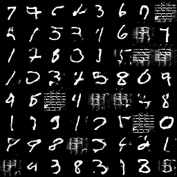

My own implementation of [Unrolled GAN][https://arxiv.org/abs/1611.02163] of MNIST , and a DCGAN MNIST with pre-condition for the sake of comparison, using tensorflow.

Noticing the architecture might be inaccurate, I use 3 convolution in discriminator part, and each learning rate being 2e-4.

The batch norm parameters are not updated as other parameters while solving surrogate loss. I wonder if it is of great influence to results.

The output is poorly optimized, as you can see, there is still pretty many mode drop sample comparing with DCGAN：



> Unrolled_GAN, K = 1, $\eta$ =1e-4, generator_learning_rate=2e-4, discriminator_learning_rate=2e-4


> DCGAN with pre-condition, generator_learning_rate=1e-4, discriminator_learning_rate=2e-4


MNIST data is required, and run

``` python
from tensorflow.examples.tutorials.mnist import input_data
input_data.read_data_sets('MNIST_data', one_hot=True)
```

in shell would automatically download the data.